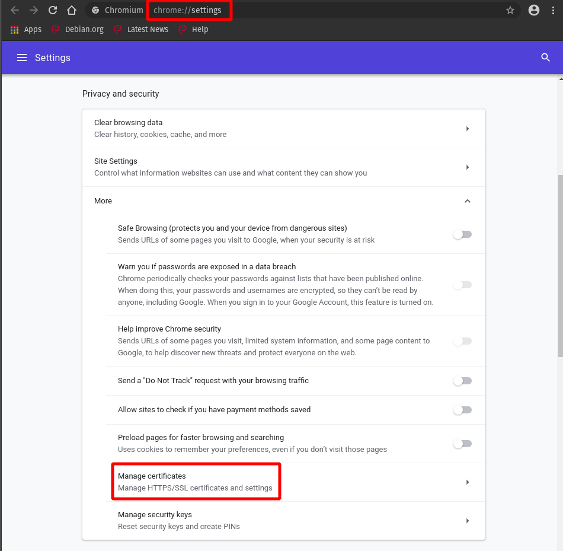

# Создание самоподписанных SSL сертификатов

Note: все скрипты ниже опираются на директорию, в которой лежат. Перенос скриптов в другую директорию может всё
испортить.

## Создание Certificate Authority или root- сертификата и ключа

Выполняется 1 раз и надолго (пока не истечёт предыдущий сертификат, например). В целях безопасности () нужно создавать
отдельные CA для тестирования и production, а также не шарить ничего кроме root-сертификата.

### Что делать:

- Запускаем `ssl-certification/create_root_cert.sh`. После этого в директории `ssl-certification` появятся `.crt`
  CA-сертификат и `.key` приватный CA-ключ.

## Создание сертификата и ключа для домена

Выполняется отдельно для каждой машины.

### Что делать:

- В файле `.env` в корне проекта в переменную `DNS_DOMAINS` через точку с запятой ';' вносим все dns-имена, по которым к
  данному домену будут обращаться. Аналогично в `IP_DOMAINS` вносим все ip-адреса.
- Запускаем `ssl-certification/create_domain_cert.sh`. После этого в директории `frontend/nginx/ssl` появятся `.crt`
  сертификат и `.key` приватный ключ домена. Они используются docker-файлом фронтенда.

## Добавление в браузер

### Что делать:

- Необходимо вручную добавить CA-сертификат (`ssl-certification/*.crt`) в каждый браузер на каждой машине, где
  необходимо подключаться к ресурсу по `https`.
- В Firefox:
  

  

  

  

  

- В Chromium:
  

  

  

  

- В качестве альтернативы можно вопользоваться [Active Directory](https://ru.wikipedia.org/wiki/Active_Directory).
